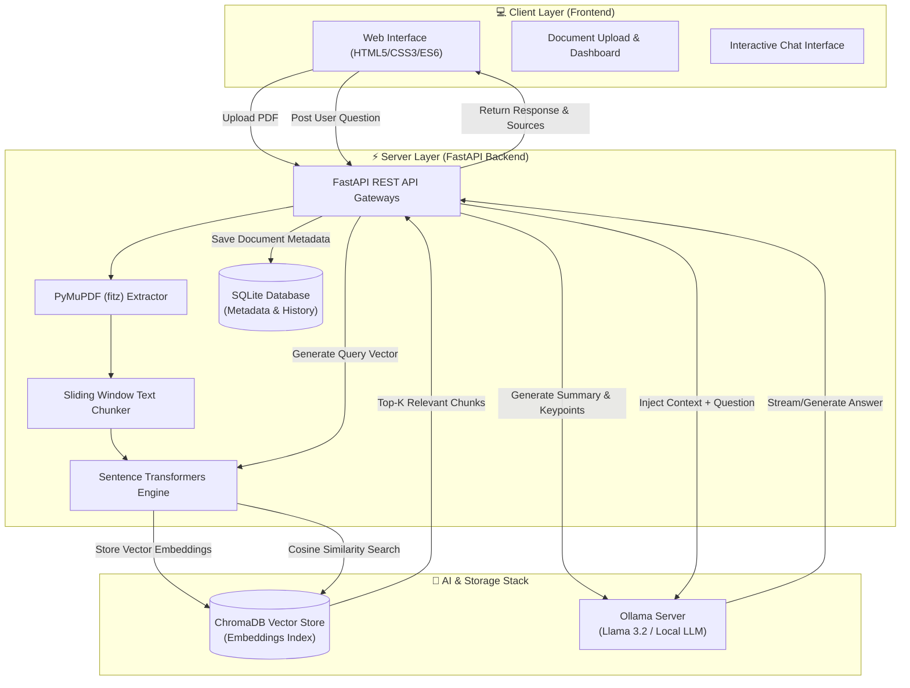

# 🔬 ResearchMind AI

<div align="center">


<p align="center">
  <b>A Privacy-First, Full-Stack Retrieval-Augmented Generation (RAG) Platform for Intelligent Document Analysis & Conversational AI</b>
</p>

[Key Features](#-key-features) •
[Architecture](#-system-architecture) •
[Tech Stack](#-tech-stack) •
[Quick Start](#-quick-start--installation) •
[API Reference](#-api-reference) •
[Docker Setup](#-docker-deployment)

</div>

---

## 📖 Overview

**ResearchMind AI** is an end-to-end, high-performance **Retrieval-Augmented Generation (RAG)** application designed for seamless PDF document processing, semantic search, automated summarization, and interactive Q&A. 

Unlike cloud-dependent solutions, **ResearchMind AI** leverages **Ollama (Llama 3.2)** and **ChromaDB** to ensure **100% data privacy** and fast execution locally on your workstation or private infrastructure.

### 🌟 Why ResearchMind AI?
- 🔒 **100% Local & Private**: No data leaves your machine; LLM inference and vector storage run locally.
- ⚡ **High Precision Contextual Answers**: Retrieves exact content chunks from documents before passing relevant context to the LLM.
- 📄 **Deep Document Analysis**: Extracts text, page counts, auto-generates key insights, and builds document summaries upon upload.
- 🎨 **Modern Responsive UI**: Built with a sleek dark/light theme toggle, interactive document library, real-time file upload indicators, and persistent chat history.

---

## 🏗️ System Architecture

ResearchMind AI employs a decoupled architecture split into an asynchronous **FastAPI backend** and a lightweight **vanilla Web frontend**.



---

## ✨ Key Features

| Feature | Description |
| :--- | :--- |
| 📄 **PDF Ingestion & Parsing** | Fast text extraction from single or multi-page PDFs using **PyMuPDF (`fitz`)**. |
| ✂️ **Smart Chunking Engine** | Overlapping sliding-window chunking ensures semantic continuity across page breaks. |
| 🔍 **Vector Embeddings & Search** | High-dimensional embedding generation via **Sentence Transformers** indexed in **ChromaDB**. |
| 🤖 **Ollama LLM Integration** | Powered by **Llama 3.2** for grounded, hallucination-resistant answers and key point extractions. |
| 📚 **Research Library** | Overview of uploaded documents with file size, total pages, chunk counts, and one-click deletion. |
| 💬 **Context-Aware Q&A** | Chat with specific documents or query across your entire knowledge library with source attribution. |
| 🌗 **Dark & Light Mode** | Modern responsive dashboard interface adaptable to user system preferences. |
| 🐳 **Containerized Deployment** | Single-command Docker build for hassle-free deployment across environments. |

---

## 🛠️ Tech Stack

### Frontend
- **HTML5 & CSS3**: Custom responsive layout with modern glassmorphism aesthetic and CSS variable design tokens.
- **JavaScript (ES6+)**: Modular client-side script handling fetch requests, DOM updates, local state, and stream parsing.

### Backend Framework
- **FastAPI**: Asynchronous Python web framework for high-concurrency API performance.
- **Uvicorn & Gunicorn**: Production-grade ASGI server implementation.
- **SQLAlchemy & SQLite**: Lightweight relational database for file metadata, chunk counts, and upload records.
- **Pydantic v2**: Type safety and payload schema validation.

### AI & Vector DB Stack
- **Ollama**: Local LLM runner hosting models like `llama3.2`, `mistral`, or `deepseek`.
- **ChromaDB**: Open-source vector database for similarity search and persistent embeddings index.
- **Sentence Transformers**: `all-MiniLM-L6-v2` dense vector embedding model.
- **PyMuPDF**: Ultra-fast PDF parsing and metadata extraction.

---

## 📂 Project Structure

```
ResearchMind-AI/
├── Dockerfile                  # Containerized deployment blueprint
├── LICENSE                     # MIT License
├── README.md                   # Project documentation
├── backend/
│   ├── app/
│   │   ├── __init__.py
│   │   ├── config.py           # Central configuration & env loaders
│   │   ├── database.py         # SQLite connection & ORM session setup
│   │   ├── dependencies.py     # FastAPI dependencies & database session injectors
│   │   ├── main.py             # FastAPI entry point & CORS configuration
│   │   ├── models.py           # SQLAlchemy database tables (Document model)
│   │   ├── schemas.py          # Pydantic request/response validation models
│   │   ├── utils.py            # Helper utilities and formatting functions
│   │   ├── routers/
│   │   │   ├── chat.py         # RAG Q&A endpoint (/chat)
│   │   │   ├── documents.py    # Document listing & management (/documents)
│   │   │   ├── health.py       # API status & health monitor (/health)
│   │   │   └── upload.py       # PDF processing & vector indexing (/upload)
│   │   └── services/
│   │       ├── chunking.py     # Document text chunking logic
│   │       ├── embeddings.py   # Vector embedding generation service
│   │       ├── ollama.py       # Ollama LLM prompt & response handler
│   │       ├── parser.py       # PyMuPDF text & page extractor
│   │       ├── rag.py          # Vector retrieval + LLM synthesis orchestrator
│   │       └── vector_store.py # ChromaDB collection CRUD operations
│   ├── chroma_db/              # Persistent ChromaDB vector store directory
│   ├── database/               # SQLite database file store (researchmind.db)
│   ├── requirements.txt        # Python backend package dependencies
│   └── uploads/                # Document storage location for uploaded PDFs
└── frontend/
    ├── app.js                  # Frontend logic & API fetch layer
    ├── config.js               # Frontend environment & API base URLs
    ├── index.html              # Main HTML dashboard structure
    └── style.css               # Modern CSS theme & dynamic layout rules
```

---

## 🚀 Quick Start & Installation

### Prerequisites

Ensure you have the following installed on your machine:
- **Python**: `3.10` or `3.11+`
- **Ollama**: [Download Ollama](https://ollama.com/download)
- **Git**

---

### Step 1: Clone the Repository

```bash
git clone https://github.com/manishPawar007/RAG-ChatBot.git
cd RAG-ChatBot
```

---

### Step 2: Set Up Virtual Environment

#### Windows (PowerShell / CMD)
```powershell
python -m venv venv
.\venv\Scripts\activate
```

#### Linux / macOS
```bash
python3 -m venv venv
source venv/bin/activate
```

---

### Step 3: Install Backend Dependencies

```bash
pip install --upgrade pip
pip install -r backend/requirements.txt
```

---

### Step 4: Configure & Run Ollama

1. Start the Ollama server:
   ```bash
   ollama serve
   ```
2. Pull the default **Llama 3.2** model:
   ```bash
   ollama pull llama3.2
   ```

---

### Step 5: Environment Setup

Create a `.env` file in the `backend/` directory (or modify `backend/app/config.py` defaults):

```ini
# Backend Environment Configuration
PROJECT_NAME="ResearchMind AI"
VERSION="1.0.0"

# Ollama LLM Settings
OLLAMA_BASE_URL="http://localhost:11434"
OLLAMA_MODEL="llama3.2"

# Database & Vector DB Settings
DATABASE_URL="sqlite:///./database/researchmind.db"
CHROMA_DB_PATH="./chroma_db"
EMBEDDING_MODEL="all-MiniLM-L6-v2"
```

---

### Step 6: Launch the Application

#### Option A: Running Backend & Frontend Separately

1. **Start FastAPI Backend**:
   ```bash
   # From project root:
   python -m uvicorn backend.app.main:app --reload --port 8000
   ```
   *The API will be live at `http://127.0.0.1:8000`*  
   *Swagger API Documentation: `http://127.0.0.1:8000/docs`*

2. **Start Frontend Web Server**:
   ```bash
   # In a new terminal tab, navigate to frontend directory:
   cd frontend
   python -m http.server 5500
   ```
   *Open your browser and navigate to:* **`http://127.0.0.1:5500`**

---

## 🐳 Docker Deployment

You can run the entire application inside a single Docker container.

### Build Docker Image
```bash
docker build -t researchmind-ai .
```

### Run Docker Container
```bash
docker run -d \
  -p 8000:8000 \
  --name researchmind \
  -e OLLAMA_BASE_URL="http://host.docker.internal:11434" \
  researchmind-ai
```

> **Note**: Ensure Ollama is running on your host machine so `host.docker.internal` can route LLM requests properly.

---

## 📡 API Reference

ResearchMind AI provides a clean RESTful API interface documented automatically via OpenAPI / Swagger.

| Method | Endpoint | Description | Sample Payload / Params |
| :--- | :--- | :--- | :--- |
| `GET` | `/` | API Root Welcome info | None |
| `GET` | `/health` | System health status | None |
| `POST` | `/upload/` | Upload & process PDF document | `multipart/form-data` (`file`) |
| `POST` | `/chat/` | Query documents via RAG | `{"question": "...", "document_id": "optional_id"}` |
| `GET` | `/documents/` | Get list of all documents | None |
| `GET` | `/documents/{id}`| Get specific document details | Path param `id` |
| `DELETE`| `/documents/{id}`| Delete document & vector embeddings| Path param `id` |

---

### Request & Response Examples

#### 1. Upload Document (`POST /upload/`)

**Request**:
```http
POST /upload/ HTTP/1.1
Content-Type: multipart/form-data

file: research_paper.pdf
```

**Response**:
```json
{
  "success": true,
  "document_id": 1,
  "filename": "research_paper.pdf",
  "pages": 12,
  "chunks": 48,
  "summary": "This paper presents a novel approach to zero-shot learning...",
  "key_points": [
    "Introduces transformer-based retrieval.",
    "Achieves 94.2% accuracy on benchmark tests."
  ],
  "metadata": {
    "pages": 12,
    "title": "Novel Zero-Shot Framework"
  }
}
```

#### 2. Chat with Documents (`POST /chat/`)

**Request**:
```json
{
  "question": "What accuracy did the proposed methodology achieve?",
  "document_id": "1"
}
```

**Response**:
```json
{
  "answer": "According to the uploaded document, the proposed framework achieves an accuracy of 94.2% on standard benchmark tests.",
  "sources": [
    {
      "text": "In section 4.2, experimental results demonstrate an overall accuracy of 94.2% across benchmark datasets...",
      "metadata": {
        "page": 8,
        "filename": "research_paper.pdf"
      }
    }
  ]
}
```

---

## 🔄 RAG Workflow Explained

```
[ User PDF Upload ]
        │
        ▼
[ PyMuPDF Text Extraction ] ──► [ Sliding-Window Chunking (500 tokens, 50 overlap) ]
                                            │
                                            ▼
                               [ Sentence Transformers Embedding ]
                                            │
                                            ▼
                                [ ChromaDB Vector Database ]

────────────────────────────────────────────────────────────────────────────

[ User Input Query ] ──► [ Dense Vector Generation ]
                               │
                               ▼
               [ Vector Similarity Search in ChromaDB ]
                               │
                               ▼
               [ Retrieve Top-K Most Relevant Context Chunks ]
                               │
                               ▼
               [ Construct Contextual Prompt Payload ]
                               │
                               ▼
               [ Ollama (Llama 3.2) Inference Engine ]
                               │
                               ▼
               [ Grounded Answer + Source Attributions ]
```

---

## 🛡️ Troubleshooting & FAQ

<details>
<summary><b>1. Error: Ollama connection refused / 500 Internal Server Error</b></summary>

- Make sure the Ollama application is running on your system (`ollama serve`).
- Verify that `OLLAMA_BASE_URL` in `.env` or `config.py` matches `http://localhost:11434`.
- Run `ollama list` in your command line to ensure `llama3.2` is pulled.
</details>

<details>
<summary><b>2. How can I use a different LLM model (e.g. DeepSeek / Mistral)?</b></summary>

- Pull your desired model: `ollama pull mistral`
- Update `.env`: `OLLAMA_MODEL=mistral`
- Restart the backend server.
</details>

<details>
<summary><b>3. CORS Issues when opening `index.html` directly in browser?</b></summary>

- Do not open `index.html` directly as `file:///...`. Serve it using an HTTP web server like `python -m http.server 5500` or VS Code Live Server extension.
</details>

---

## 🛣️ Roadmap

- [ ] 📈 **Streaming Responses**: Real-time token streaming for LLM outputs.
- [ ] 📑 **Multi-modal Support**: Image and table extraction from complex PDF documents.
- [ ] 🎯 **Citation Highlighting**: Interactive PDF preview with highlighted context source passages.
- [ ] 🔐 **User Accounts & Auth**: Multi-tenant workspace and document access permissions.
- [ ] 📥 **Export Conversations**: Export chat history and synthesized summaries as Markdown or PDF reports.

---

## 🤝 Contributing

Contributions, issues, and feature requests are welcome!

1. Fork the Project
2. Create your Feature Branch (`git checkout -b feature/AmazingFeature`)
3. Commit your Changes (`git commit -m 'Add some AmazingFeature'`)
4. Push to the Branch (`git push origin feature/AmazingFeature`)
5. Open a Pull Request

---

## 📝 License

Distributed under the **MIT License**. See [`LICENSE`](LICENSE) for more details.

---

## 👨‍💻 Author

**Manish Pawar**  
- GitHub: [@manishPawar007](https://github.com/manishPawar007)

---

<div align="center">
  <sub>Built with ❤️ using FastAPI, ChromaDB, and Ollama</sub>
</div>